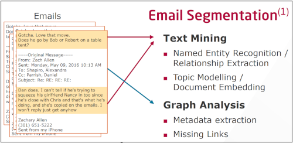
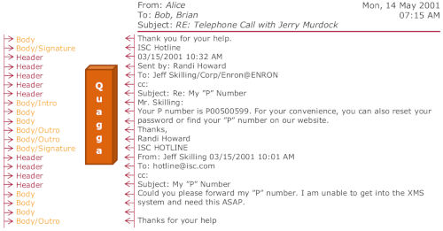
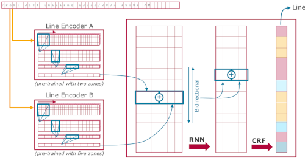

# Quagga [](https://travis-ci.com/HPI-Information-Systems/QuaggaLib)
QuaggaLib was developed to provide an easy-to-use library for the model we describe in our ECIR paper (see below). 
For code, data, and competitor approaches used in the paper, please check out [our other repository](https://github.com/HPI-Information-Systems/Quagga).



QuaggaLib parses the raw email body into separate blocks and extracts meta-data from inline-headers.
This kind of pre-processing should be used in all applications using email data.
The library provides the actual written text content as well as the meta-data that would otherwise be hidden in the unstructured email body.



The Quagga model classifies each line into one of five types: Header, Body, Body/Intro, Body/Outro, Body/Signature.
We also provide models which only distinguish Header and Body.



At the heart of Quagga, we use a neural network.
For more information, we refer to our paper presented at ECIR 2018.
QuaggaLib wraps this model and adds modular processing steps to read *.eml files, a web frontend and server, a parser that uses the line classifications to form blocks, and a parser that extracts structured data from Header blocks.

## Usage
### Installation
```bash
pip install https://github.com/HPI-Information-Systems/QuaggaLib/archive/master.zip
```

Note, that QuaggaLib currently only works with Python 3.6!

### QuaggaServer
QuaggaServer provides a web interface for easy manual testing.
To use the interface, run 

```bash
export FLASK_APP=QuaggaServer/QuaggaServer.py
python3 -m flask run
```

... and open https://localhost:5000/index in your favourite browser.

The interface is self-explanatory.
We provide multiple pre-trained models in QuaggaLib.
You can select a model that was trained on the Enron corpus or our ASF corpus.
Furthermore you can switch between 2-zone or 5-zone classification.
By toggling the CRF/CNN switch, you can use either the line encoder result or that after the full model.

### QuaggaLib for line classification
```python
from Quagga import Quagga, 
                   EmailDirectoryReader, 
                   ListReaderRawEmailTexts, 
                   ListReaderExtractedBodies, 
                   TempQuaggaReader,
                   ModelBuilder
from Quagga.Utils.BlockParser.BlockParser import BlockParser

quagga = Quagga(ListReaderExtractedBodies(''), 
                output_dir='', # optional, saves to directory if set
                model_builder=ModelBuilder(with_crf=True, zones=2, trainset='enron'), # optional
                block_parser=BlockParser()) # optional

classified_lines = quagga.predict(email_body_text)
```

You can use the `ListReaderExtractedBodies([body1, body2,..])` to iterate over a bulk of email bodies.
Alternatively you can use the `ListReaderRawEmailTexts` and let QuaggaLib handle the parsing of a RFC822 formatted email.

### QuaggaLib for full parsing
```python
# ... continuing from above ...
# Note: the parse needs raw emails as input!
parsed_email = quagga._parse(classified_lines, full_email_as_text)
```

### QuaggaLib on files
Please check out the `Examples/` folder for more details.
QuaggaLib can read email files from disk and even store (or retrieve) partly processed emails.
This is especially helpful if you are developing your own parser modules, as parts of the potentially complex processing steps can be skipped.

### Extending QuaggaLib
_coming soon._

## Reference

> Repke, Tim and Krestel R. *Bringing Back Structure to Free Text Email Conversations with Recurrent Neural Networks.* ECIR 2018

For more details, please check out our website at: https://hpi.de/naumann/projects/web-science/business-communication-analysis/email-structure.html

### Abstract
Email communication plays an integral part of everybody’s
life nowadays. Especially for business emails, extracting and analysing
these communication networks can reveal interesting patterns of processes
and decision making within a company. Fraud detection is another
application area where precise detection of communication networks is
essential. In this paper we present an approach based on recurrent neural
networks to untangle email threads originating from forward and reply
behaviour. We further classify parts of emails into 2 or 5 zones to capture
not only header and body information but also greetings and signatures.
We show that our deep learning approach outperforms state-of-the-art
systems based on traditional machine learning and hand-crafted rules.
Besides using the well-known Enron email corpus for our experiments,
we additionally created a new annotated email benchmark corpus from
Apache mailing lists.


